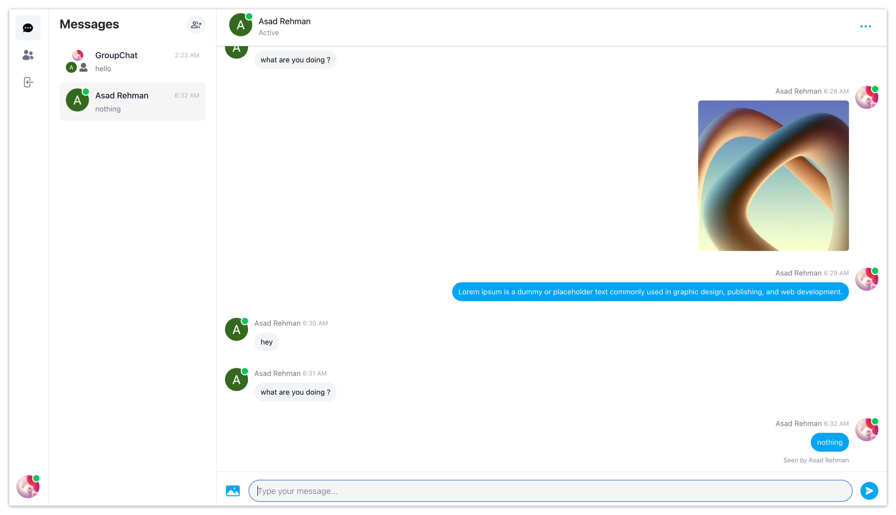

# Echo 💬

**Real Time Chat Application built with Next.js**  
Stay connected with instant messaging, group chats, media sharing, and powerful authentication — all wrapped in a sleek Tailwind-powered design.

---

## 🚀 Features

- **Real time messaging using Pusher**
- **Message notifications and alerts**
- **Tailwind design for sleek UI**
- **Tailwind animations and transition effects**
- **Full responsiveness for all devices**
- **Credential authentication with NextAuth**
- **Google authentication integration**
- **Github authentication integration**
- **File and image upload using Cloudinary CDN**
- **Client form validation and handling using react-hook-form**
- **Server error handling with react-toast**
- **Message read receipts**
- **Online/offline user status**
- **Group chats and one-on-one messaging**
- **Message attachments and file sharing**
- **User profile customization and settings**
- **How to write POST, GET, and DELETE routes in route handlers (app/api)**
- **How to fetch data in server React components by directly accessing the database**
- **Handling relations between Server and Child components in a real time environment**
- **Creating and managing chat rooms and channels**  

---

## 🛠 Tech Stack

- **Frontend & SSR**: Next.js  
- **Real-time messaging**: Pusher
- **Authentication**: NextAuth
- **Database**: MongoDB with **Prisma ORM**        
- **State Management**: Zustand * ContextAPI  
- **UI Library**: HeadlessUI    
- **File Storage**: Cloudinary
- **Deployment**: Vercel

---

## 📝 Author

**Asad Rehman** — [GitHub](https://github.com/asadrehman1)  

---

## ⚡ License

MIT © 2025 Asad Rehman
